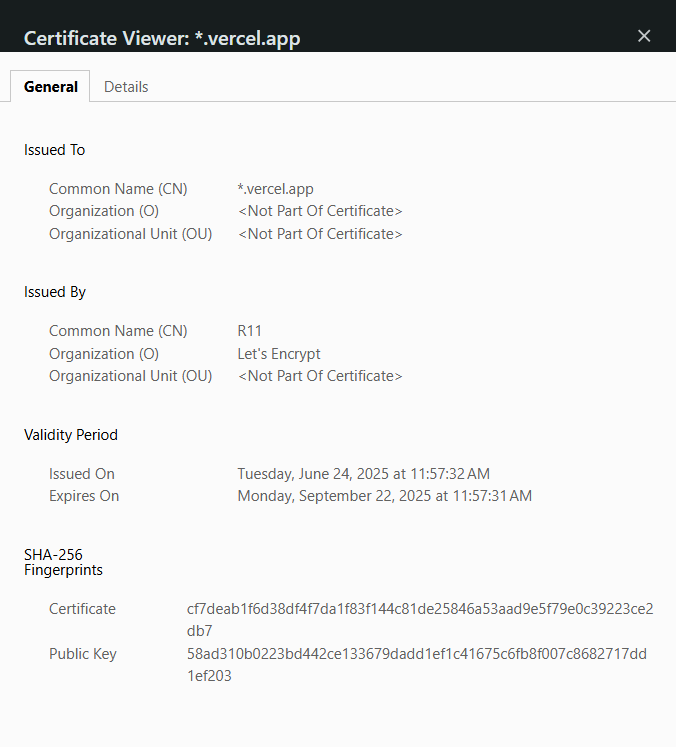
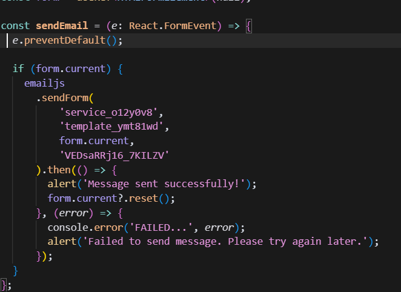

# MBC Laboratory Website

A modern, responsive website for MBC Laboratory (Multimedia, Big Data, and Cybersecurity Laboratory) built with Next.js 15, TypeScript, and Tailwind CSS.

## 🏗️ Project Structure

```
mbcweb/
├── public/                    # Static assets
│   ├── logo.png              # MBC Laboratory logo
│   ├── MBC 2.png            # About section image
│   ├── NCM 1.png            # About section image
│   ├── foto.png             # Developer photo
│   └── *.svg                # Various SVG icons
├── src/
│   ├── app/                 # Next.js App Router
│   │   ├── layout.tsx       # Root layout with providers
│   │   ├── page.tsx         # Homepage (/)
│   │   ├── globals.css      # Global styles
│   │   ├── kontak/          # Contact page (/kontak)
│   │   │   └── page.tsx     # Contact form with EmailJS
│   │   ├── divisi/          # Division page (/divisi)
│   │   │   └── page.tsx     # Division carousel
│   │   └── developer/       # Developer page (/developer)
│   │       └── page.tsx     # Developer profile
│   ├── components/          # React components
│   │   ├── Header.tsx       # Navigation header
│   │   ├── HeroSection.tsx  # Hero with video background
│   │   ├── AboutSection.tsx # About MBC Laboratory
│   │   ├── VisionMissionSection.tsx # Vision & Mission
│   │   ├── Footer.tsx       # Site footer
│   │   ├── VideoBackground.tsx # YouTube video background
│   │   ├── ScrollAnimatedSection.tsx # Scroll animations
│   │   └── ui/              # Shadcn/ui components
│   │       ├── button.tsx   # Button component
│   │       ├── carousel.tsx # Carousel component
│   │       └── *.tsx        # Other UI components
│   ├── hooks/               # Custom React hooks
│   │   ├── use-mobile.tsx   # Mobile detection
│   │   ├── useScrollAnimation.tsx # Scroll animations
│   │   ├── useScrollOptimized.tsx # Optimized scroll
│   │   └── use-toast.ts     # Toast notifications
│   └── lib/                 # Utilities
│       ├── constants.ts     # App constants
│       └── utils.ts         # Utility functions
├── package.json             # Dependencies & scripts
├── next.config.ts           # Next.js configuration
├── tsconfig.json            # TypeScript configuration
├── postcss.config.mjs       # PostCSS configuration
├── eslint.config.mjs        # ESLint configuration
└── tailwind.config.js       # Tailwind CSS configuration
```

## 🛠️ Local Installation

### **Installation Steps:**

1. **Clone the repository:**
   ```bash
   git clone https://github.com/Hafiz010/MBC-tech-WEB.git
   cd MBC-tech-WEB
   ```

2. **Install dependencies:**
   ```bash
   npm install
   # or
   yarn install
   # or
   pnpm install
   ```

3. **Run development server:**
   ```bash
   npm run dev
   # or
   yarn dev
   # or
   pnpm dev
   ```

## 🚀 Deployment

### **Vercel Deployment (Recommended):**

1. **Push to GitHub:**
   ```bash
   git add .
   git commit -m "Ready for deployment"
   git push origin main
   ```

2. **Deploy on Vercel:**
   - Go to [vercel.com](https://vercel.com)
   - Sign up/Login with GitHub
   - Click "New Project"
   - Import your repository
   - Vercel auto-detects Next.js
   - Add environment variables if needed
   - Click "Deploy"

## 🔒 SSL Configuration

### **Vercel (Automatic):**
- ✅ SSL certificates are automatically provisioned
- ✅ HTTPS is enabled by default
- ✅ No additional configuration needed

<div align="center">
  <p>
      
  </p>
</div>
## 🔧 Backend Configuration


### **Adding Backend (Optional):**
<div align="center">
  <p>
      
  </p>
</div>

**Built with ❤️ for MBC Laboratory**
